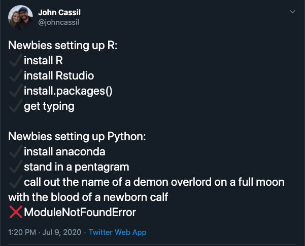

```{r setup, include=FALSE}
knitr::opts_chunk$set(echo = T,message=F,error=F,warning = F,cache = T)
require(lubridate)
require(tidyverse)
require(ggthemes)
require(gghighlight)
```

layout: true

<div class="slide-footer"><span> 
"Enhance and Advance"

&emsp;&emsp;&emsp;&emsp;&emsp;&emsp;&emsp;

Data Wrangling in Python <!-- Week of the Footer Here -->

&emsp;&emsp;&emsp;&emsp;&emsp;&emsp;&emsp;&emsp;&emsp;&emsp;

http://ericdunford.com/enhance_and_advance_R/

</span></div> 

---
class: outline

# Plan for Today 

![:space 1]

- Introduction to **Objects** in Python

![:space 1]

- Explore the **`Pandas`** Module

![:space 1]

- **Processing data** in and joining data 

![:space 1]

- **Data Manipulation** in Python using Pandas

---

# Materials for Today

![:space 25]

.center[
  **[http://ericdunford.com/enhance_and_advance_R/](http://ericdunford.com/enhance_and_advance_R/)**
]


---


![:space 10]




---

# Google Colabs

![:space 5]

- Google Colaboratory, or "Colab" for short, allows you to write and execute Python in your browser, with

  + Zero configuration required
  + Free access to GPUs (great for machine learning applications)
  + Easy sharing

- We'll use Google Colab for today to sidestep installation issues. 

- [What is Google Colab?](https://colab.research.google.com/notebooks/intro.ipynb#scrollTo=-Rh3-Vt9Nev9)

- Overview of [Google Colab features](https://colab.research.google.com/notebooks/basic_features_overview.ipynb)

---

class: newsection

# Objects in Python

---

## Object Assignment

- `=` is the **assignment** operator in Python. 

- When using it, a **reference** is assigned to an object (e.g. below, `x` references the object `4` in the statement `x = 4`). 

```{python}
x = 4
```

An **_objects type_** is defined at runtime (also known as ["duck typing"](https://en.wikipedia.org/wiki/Duck_typing))

- Python is a dynamically typed language, which differs from other languages where type must be made explicit (e.g. cpp)
- Type cannot be changed once established.
  
```{python}
type(x)
```

---

An objects **_class_** provides a **_blueprint for object behavior and functionality_**. We use the pointer `.` to access an objects methods. 

```
x.
  |
  V
   __add__()  # method dictating behavior to the `+` operator 
   __mult__() # method dictating behavior to the `*` operator 
   __mod__()  # method dictating behavior to the `%` operator 
   __eq__()   # method dictating behavior to the `==` operator 
     .
     .
     .
```

Each **class** has certain properties and methods that we use to assign and access variables and methods (functions) that perform some predefined procedure on the objects. 

---

## Importing functionality 

- Python is a scripting language that wasn't built explicitly for data analysis (like `R`). 

- Python comes build-in with a "standard library" of modules, but we need to **_import_** modules build for scientific computing. 

- Installing a module in python

```{shell,eval=F}
# In terminal
pip install <module name>
```

```{python,eval=F}
# In Jupyter/Google Colab
!pip install <module name>
```


- Importing module in a script

```{python,eval=F}
import <module name>
```

---

## Scientific Computing in Python
  
![:space 5]

- [SciPy](https://www.scipy.org/) (pronounced “Sigh Pie”) is a Python-based ecosystem of open-source software for mathematics, science, and engineering. 

- Primary packages in this ecosystem:

  + `scipy` - main package for scientific computing
  + `numpy` - package for matrix manipulation
  + **_`pandas` - package for data structures_**
  + `matplotlib` - package of data visualization
  - `sympy` - package for processing symbolic math
  
---

## Importing

![:space 3]

- **_Modules are objects_**.

--

![:space 3]

- Modules can be renamed into convenient **_monikers_** upon importation 

```{python}
import pandas as pd
```


--

![:space 3]

- Also, specific **_components of a package can be imported_**. This means we don't need to important the entirety of a package, but rather can do it piecemeal.

```{python}
from pandas import DataFrame as df
```

---

## Let's get into it!

![:space 2]

- We'll be covering a lot of ground today. I've organized the data manipulation discussion into two Google Colab notebooks. 

![:space 2]

- _These annotated notebooks are meant to be a reference_. We won't be able to walk through every line of code. The aim of this workshop is to provide participants with some underlying intuition of working with data in Python.

![:space 2]

- Colab Notebooks for today:

  + [Part 1 - Data in Python](https://drive.google.com/file/d/1FWERVebshSI-RKHZZ-J8gNbsKODNpv6A/view?usp=sharing)
  
  + [Part 2 - Manipulating data in Python](https://drive.google.com/file/d/1TY9KpIoigY8lAYdJclHqPIxA0fH8fnEf/view?usp=sharing)


